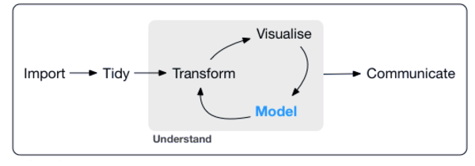
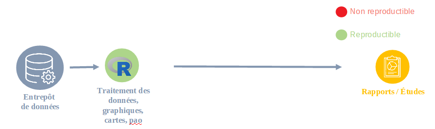

```{r setup, include=FALSE}
options(htmltools.dir.version = FALSE)
```


class: inverse, center, middle

background-image: url(www/quiestce.jpg)

# A propos de moi

---

# Qui suis-je ?

- Maël THEULIERE
- Administrateur Insee
- R-addict depuis 5 ans
- Membre du [réseau des référents R du ministère de la transition écologique et solidaire](https://mtes-mct.github.io/parcours-r/)
- Animateur du DREAL `<datalab />` Pays de la Loire à la [Direction Régionale de l'Environnement, de l'Aménagement et du Logement](http://www.pays-de-la-loire.developpement-durable.gouv.fr/)

---
class: inverse, center, middle
# Un dataquoi ?
---
# Un centre de service autour de la donnée

Quelques réalisations:

- scraping des annonces immo pour [mesurer le marché du locatif privé](http://apps.datalab.pays-de-la-loire.developpement-durable.gouv.fr/siclop/);

- [application](http://apps.datalab.pays-de-la-loire.developpement-durable.gouv.fr/qualite-des-eaux/) de datavisualisation sur la présence des pesticides dans les cours d'eau;

- [application](http://apps.datalab.pays-de-la-loire.developpement-durable.gouv.fr/enr_reseaux_teo/) de datavisualisation de l'évolution des énergies renouvelables sur la région;

- estimation du nombre de copropriétés fragiles.

---
class: inverse, center, middle

# Et donc des publications
---

class: inverse, center, middle

background-image: url(www/publications.jpg)

# BEAUCOUP de publications
---
class: inverse, center

background-image: url(https://media.giphy.com/media/4NVg2TW4RL0je/giphy.gif)
background-size: 400px

# A mettre à jour régulièrement
---
class: inverse, center, middle

# Qu'est ce qu'une publication statistique ?
---
class: center, middle

# Un projet data intégré !


---

# L'enjeu : passer d'un workflow complexe et non reproductible


---

# L'enjeu : passer d'un workflow complexe et non reproductible à un workflow intégré et reproductible



---
class: inverse, center, middle

background-image: url(https://media.giphy.com/media/UMvxZQrqcUncY/giphy.gif)
background-size:cover

# S'inspirer des britanniques : le RAP

---
# RAP : reproductible analytical pipeline

- [Démarche](https://ukgovdatascience.github.io/rap_companion/) de l'office statistique du gouvernement britannique;

- Visant à mettre en place un workflow intégré;

- S'inspirant de l'approche [DataOps](https://www.dataopsmanifesto.org/).

---
# RAP : les grands principes

.pull-left[
Une publication, c'est un projet
:

- produisant un rapport Rmarkdown
- intégré
- utilisant l'approche fonctionnelle
- versionnisé
- testé
- documenté
- délivré via un package
]
.pull-right[

]
---
class: inverse, center, middle

# Un package ?


---
# Faire un package en R, c'est  simple !

- Voir ce très bon [tuto](www/Diaporama_Beldame.pdf) de Diane Beldame de Thinkr en français, présenté à la conférence R 2018 à Rennes, qui détaille comment créer un package en moins de 6 minutes.

.left-column[
```{r out.width=150, echo=F}
knitr::include_graphics("www/usethis.png")
```
]

.right-column[
{[usethis](https://usethis.r-lib.org/)} : 
le compagnon idéal pour voguer vers la création de package.

Il permet d'automatiser beaucoup de taches manuelles lors de la création d'un package.
]

---
class: inverse,center,middle
background-image:url(https://media.giphy.com/media/xT9IgzoKnwFNmISR8I/giphy.gif)
image-size:cover

# Démo : Créer son package pour une publication en 16 lignes de code
---
# Création du projet

```{r,eval=F}
library(devtools)
library(roxygen2)
library(usethis)
create_package("MaSuperPublication")
```

---
# Ajouter Git et Github

```{r,eval=F}
library(devtools)
library(roxygen2)
library(usethis)
create_package("MaSuperPublication")
use_git()
use_github()
```

---
# Ajouter une licence

```{r,eval=F}
library(devtools)
library(roxygen2)
library(usethis)
create_package("MaSuperPublication")
use_git()
use_github()
use_mit_license()
```
---
# Ajouter un readme

```{r,eval=F}
library(devtools)
library(roxygen2)
library(usethis)
create_package("MaSuperPublication")
use_git()
use_github()
use_mit_license()
use_readme_rmd()
```

---
# Ajouter un jeu de test

```{r,eval=F}
library(devtools)
library(roxygen2)
library(usethis)
create_package("MaSuperPublication")
use_git()
use_github()
use_mit_license()
use_readme_rmd()
use_testthat()
```
---
# Ajouter une brique de data préparation

```{r,eval=F}
library(devtools)
library(roxygen2)
library(usethis)
create_package("MaSuperPublication")
use_git()
use_github()
use_mit_license()
use_readme_rmd()
use_testthat()
use_data_raw()
```
---
# Ajouter un journal

```{r,eval=F}
library(devtools)
library(roxygen2)
library(usethis)
create_package("MaSuperPublication")
use_git()
use_github()
use_mit_license()
use_readme_rmd()
use_testthat()
use_data_raw()
use_news_md()
```
---
# Ajouter une fonction

```{r,eval=F}
library(devtools)
library(roxygen2)
library(usethis)
create_package("MaSuperPublication")
use_git()
use_github()
use_mit_license()
use_readme_rmd()
use_testthat()
use_data_raw()
use_news_md()
use_r("creation_graphique")
```
---
# Ajouter une dépendance

```{r,eval=F}
library(devtools)
library(roxygen2)
library(usethis)
create_package("MaSuperPublication")
use_git()
use_github()
use_mit_license()
use_readme_rmd()
use_testthat()
use_data_raw()
use_news_md()
use_r("creation_graphique")
use_package("ggplot2")
```
---
# Ajouter une vignette

```{r,eval=F}
library(devtools)
library(roxygen2)
library(usethis)
create_package("MaSuperPublication")
use_git()
use_github()
use_mit_license()
use_readme_rmd()
use_testthat()
use_data_raw()
use_news_md()
use_r("creation_graphique")
use_package("ggplot2")
use_vignette("Comment utiliser creation_graphique")
```
---
# Ajouter un template Rmarkdown

```{r,eval=F}
library(devtools)
library(roxygen2)
library(usethis)
create_package("MaSuperPublication")
use_git()
use_github()
use_mit_license()
use_readme_rmd()
use_testthat()
use_data_raw()
use_news_md()
use_r("creation_graphique")
use_package("ggplot2")
use_vignette("Comment utiliser creation_graphique")
use_rmarkdown_template(template_name = "Ma publication")
```

---
class: inverse,center,middle
background-image:url(https://media.giphy.com/media/Kf0OnhCss3AO0Kema1/giphy.gif)
image-size: cover

# Et voilà

---
class: inverse, center, middle

# Cas d'usage : l'analyse du parc locatif social
---

# Le parc locatif social en Pays de la Loire

### Le livrable

Une publication initialement de 66 pages mise à jour annuellement.

### Les données

[Le répertoire du parc locatif social](https://www.data.gouv.fr/fr/datasets/repertoire-des-logements-locatifs-des-bailleurs-sociaux/), une base de données semi-ouverte répertoriant l'ensemble des logements des bailleurs sociaux de France.

Semi ouverte : la diffusion de RPLS est régit par une loi. Par exemple, le loyer du logement ou sa vacance éventuelle ne font pas partie des infos ouvertes.

### Le processus de travail
.pull-left[
- Traitement sous tableur

- Graphiques sous tableur
]

.pull-right[
- Carte Qgis

- Mise en page via traitement de texte
]

---
# Objectifs

- Réinterroger le besoin du bénéficiaire sur le contenu

- Automatiser la publication sous la forme d'un template Rmarkdown avec les tableaux, graphiques et cartes précalculés

- Faire un prototype d'usage du RAP sur les premières briques : 
  - Réalisation de la publication en Rmarkdown
  - Approche fonctionnelle
  - Packaging
  
- "Le plus produit" : la reproductibilité dans l'espace. Permettre de décliner le rapport sur toute région via les [paramètres Rmarkdown](https://rmarkdown.rstudio.com/lesson-6.html).

---
# Quelques principes

- Tout bout de code ayant à être répliqué plus d'une fois sera dans une fonction.

- Toute fonction sera mise à disposition dans un package.

- Toute fonction qui  sera utilisée dans plus d'un projet sera dans un package à part.

---
# Analyse du processus


---
class: inverse, center, middle

# Tout bout de code ayant à être répliqué plus d'une fois sera dans une fonction.

# Toute fonction sera mise à disposition dans un package.

# Toute fonction qui  sera utilisée dans plus d'un projet sera dans un package à part.
---
# COGiter


- Gestion des fusions de communes et des rattachements supra communaux(epci, départements, régions...);

- Intégration des fonds de cartes IGN correspondants.

Lien : https://maeltheuliere.github.io/COGiter/
---
# COGiter


Package qui fait doublon avec celui de référence sur la question : [COGugaison](https://antuki.github.io/COGugaison/) de Kim Antunez. 

Réflexions en cours avec l'auteure pour intégrer les compléments dont nous avons besoin.

---
# Drealtheme - Drealdown

.pull-left[

]
.pull-right[

]

- Package permettant de décliner l'identité visuelle des publications de la DREAL en R;

- Développé par [Thinkr](Thinkr.fr) pour la DREAL.

---
# TidyRpls


Un datapackage centralisant le calcul et le stockage du datamart, permettant une réutilisation des données calculées pour d'autres usages.

Utilisation de [datapackageR](https://github.com/ropensci/DataPackageR) de [ropensci](https://ropensci.org/)
---
# rrrrpls


Ce qui reste propre à cette publication. Un package intégrant : 

- Les fonctions pour réaliser les graphiques et les cartes;

- Un template Rmarkdown ***paramétrable*** par région pour sortir le squelette de publication.

Lien : https://github.com/MaelTheuliere/rrrpls
---
# rrrrpls : un aperçu du rapport


---
class: inverse,center,middle

# La feuille de route
---
# La feuille de route

- Finaliser ce fichu rapport !

- Explorer les prochaines briques du RAP :
  - packrat/renv
  - test
  - intégration continue
  - ...

- Intégrer un rapport déclinable avec seulement les données ouvertes

- Intégrer d'autres templates (pagedown)
